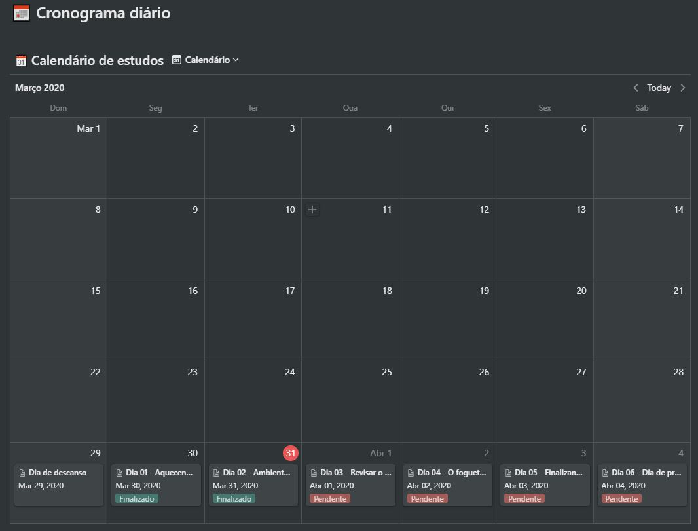
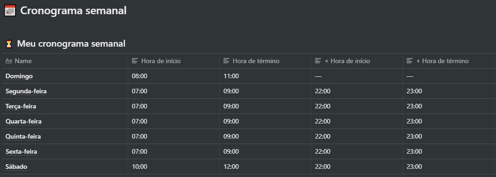
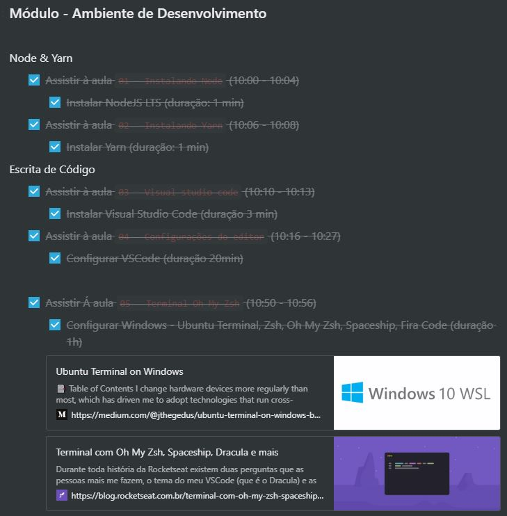

# bootcamp-gostack-desafios/desafio-1
Desafio 1 da GoStack 11

<h3 align="center">
  Desafio 1: Planejando meus estudos
</h3>

“Sua única limitação é você mesmo”!</blockquote>

  

  

  

  

  <a href="#rocket-sobre-o-desafio">Sobre o desafio</a>&nbsp;&nbsp;&nbsp;|&nbsp;&nbsp;&nbsp;
  <a href="#memo-licença">Licença</a>

## :rocket: Sobre o desafio

Nesse desafio, você deve planejar os seus estudos.

Para isso, você deve criar um cronograma que irá se adaptar ao seu tempo e ritmo.

Defina qual será seu horário de estudo, criando tarefas que estarão atreladas a um calendário, para se manter com foco e sempre alinhado com seus objetivos!

### Cronograma de estudos

Foi duplicado um modelo de cronograma criado pela Rocketseat e disponibilizado em [modelo](https://www.notion.so/Cronograma-de-estudos-e390bc8d2f5743668ec03348a3306070).

Esse modelo foi configurado e incrementado com todo meu planejamento semanal para a 1ª semana do GoStack 11.

Se quiser conferir meu cronograma, acesse o link disponibilizado abaixo, e clicar no botão "Duplicate" que fica no menu do canto superior direito da tela. 

📄 **[Link do Cronograma entregue](https://www.notion.so/Cronograma-de-estudos-836b82c49b3c40bb9a4b50cc35a27c28)**

Ele está dividido em **Cronograma semanal** e **Cronograma diário**.

### Cronograma semanal

  

Nessa sessão foram informados horários fixos para me organizar e me basear durante a minha jornada como programador, afinal, a rotina de estudos será meu primeiro passo para conseguir atingir os meus objetivos o mais rápido possível!

### Cronograma diário

  

Planejamento das minhas tarefas diárias para que consiga me preparar para consumir todo o conteúdo durante a semana.

Nele foram incluídos tarefas, material de mídia (artigos, posts, vídeos), conceitos e qualquer informação útil sobre o que estudar de forma organizada.

Exemplos de tarefas diárias:

 

Dica: foi utilizada a técnica de estudo de Pomodoro, a qual diz para ter pequenas pausas para descansar e assimilar o material estudado (pra casa 25 minutos de estudo, 5 minutos de descanso. Foi reservado também tempo para criação de conteúdos como posts no linkedin e publicação no meu GitHub.

## :memo: Licença

Esse projeto está sob a licença MIT. Veja o arquivo [LICENSE](LICENSE.md) para mais detalhes.

---

Feito com 💜 by <a href="https://www.linkedin.com/in/prenato84">Paulo Castro</a> :wave:

